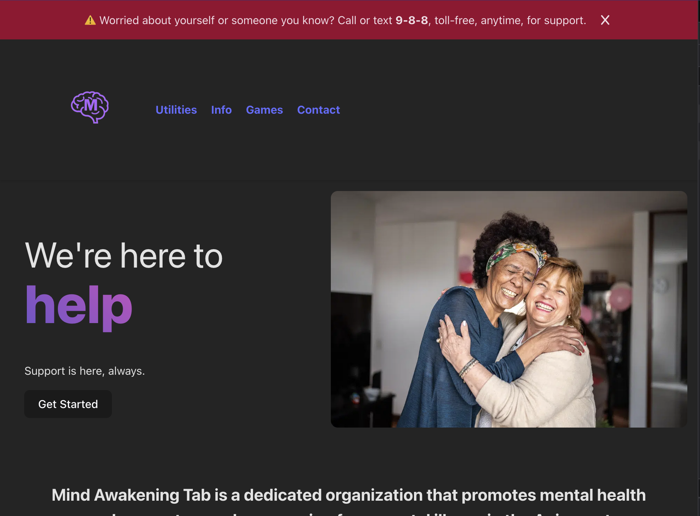

# 2024 ACI Hackathon - Theme: Mental Health

In May 2024, we participated in the ACI Hackathon focused on mental health. Our team developed a mental health based support website, winning the competition with its innovative approach.  

## Key Features:
- Interactive Games: Provides real-time emotional support.
- Mood Tracking & Analytics: Logs emotions and offers insights.
- Easy Access to Community Support: Safe, anonymous, and will give you serious help if needed.



## Lessons Learned:
- User-Centered Design: Designing with empathy.
- Teamwork & Collaboration: Working efficiently under pressure.
- Pitching & Presentation: Effectively communicating our solution.

## Building
To build the project, ensure you have `npm` installed on your system.
1. `git clone {projectlink}` - clone the project at your desired directory
2. `cd mentalheatlh-hackathon` - cd into the directory created 
3. `npm install` - run all the required build packages
4. `npm run dev` - run the development server (or `npm run build` if you want a production server)

## Notes
You may require a `.env` file if you are hosting files on a AWS s3 bucket. An example would be:
```.env
API_KEY={YOUR_API_KEY_HERE}
PORT=3000
AWS_IP=http://3.382.249.62
AWS_URL=https://master.adfklasdfas.amplifyapp.com
```
